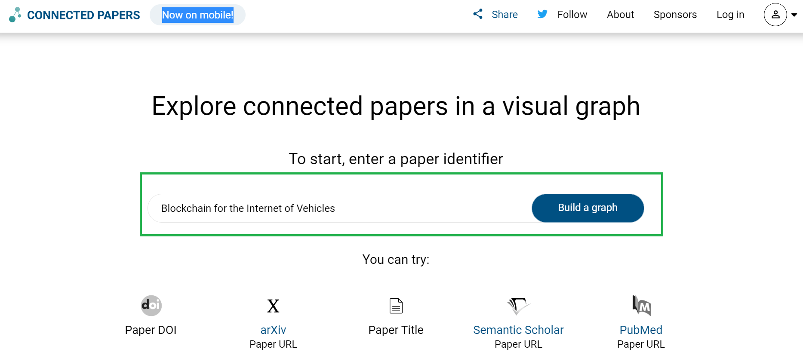
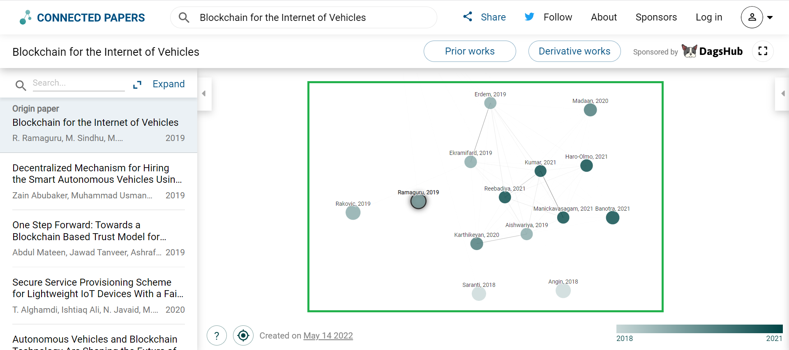

# Research Resources 

  

  

## How to Build Graph using Connected Papers

#### **Connected Papers** is a visual tool to help researchers and applied scientists find academic papers relevant to their field of work.

- Visit [Connected Papers](https://www.connectedpapers.com/)

- Search the Scholarly paper using Title or URL or DOI. 

  

- Once search result is shown, select the paper. A graph is build connecting the papers relevant to the field of work.

  

Happy Exploration. 
