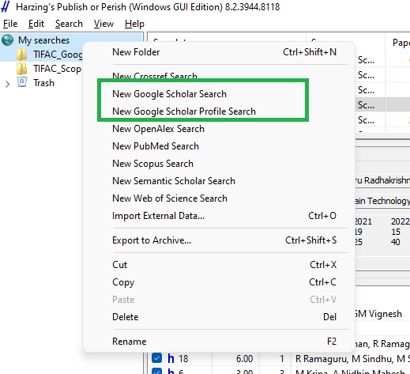
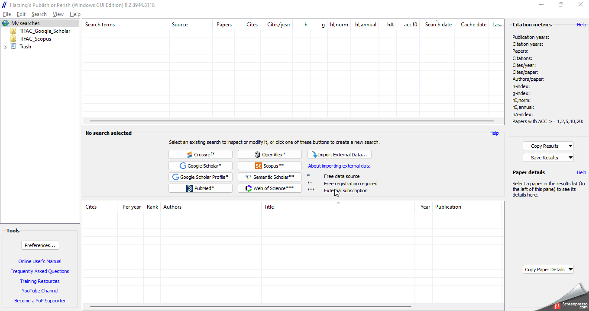
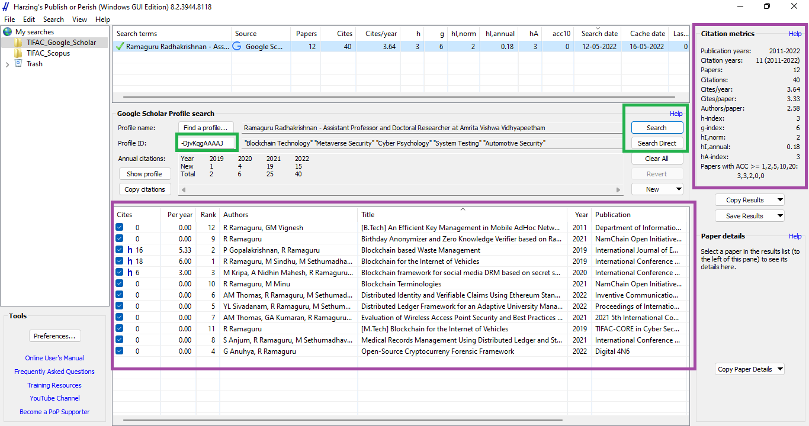

# Research Resources 

  

  

## How to perform Bibliometric Analysis 

- Download and Install [Publish or Perish](https://harzing.com/resources/publish-or-perish)

- Open Publish or Perish

#### Let's see an example of how to search using Google Scholar

- Right Click "**My Searches**" to see the list of options available

  

- Either **Google Scholar Search** can be selected or **Google Scholar Profile** can be selected

- **Google Scholar Search**, you can search papers by mentioning parameters like title, keywords, author name

- Example here shows searching for papers/publications with particular title (Automotive Forensics, Vehicle Forensics, Car Forensics)

  

[Click Here](assets/PoP_Search.gif) to view in full screen

- **Google Scholar Profile**, you can search a particular profile using their ID and analyze various metrics about them

  

- You can save these search results in a folder and use them in later time or export them in various formats

Happy Exploration. 
