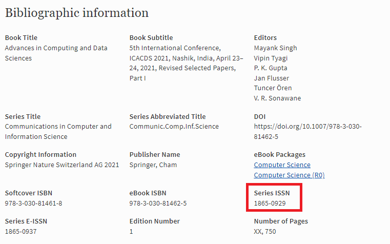
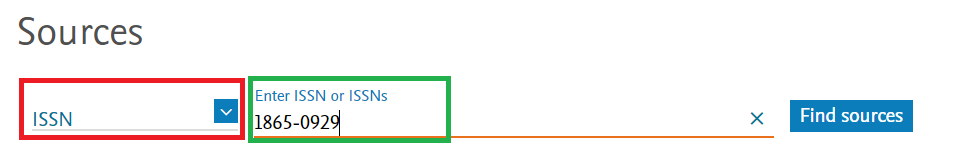
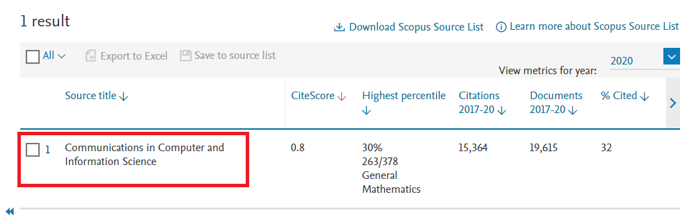
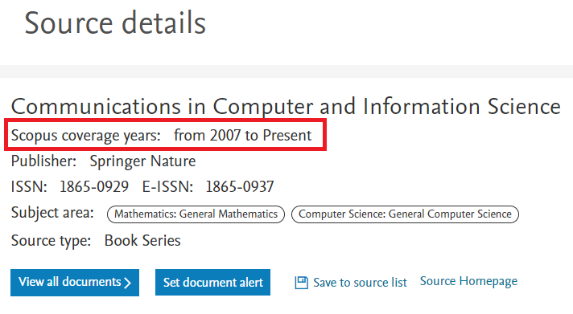

# Research Resources 

  

  

## How to find Scopus Index Journal

- Identify the Journal you wish to verify for Indexing in Scopus (Say for eg. [ICACDS](https://www.icacds.com/) which is a **Springer - CCIS**]

- From the Journal or Conference website or earlier publication page, please find the Journal **ISSN Number** [ eg. [ICACDS Previous Publication - 2021](https://link.springer.com/book/10.1007/978-3-030-81462-5)]

- Check for **Series-ISSN** and copy the same

  

- Visit [Scopus](https://www.scopus.com/sources.uri?zone=TopNavBar&origin=searchbasic) Site

- Search using ISSN option and provide the ISSN Number copied. Select the Journal from Search Results. 

  
  

**Note: If there is no result, then the Journal is not Scopus Indexed**

- Now, Select the Journal to view the details. **Check the Years of Coverage, it should be PRESENT**

  

Hope this was helpful. 
